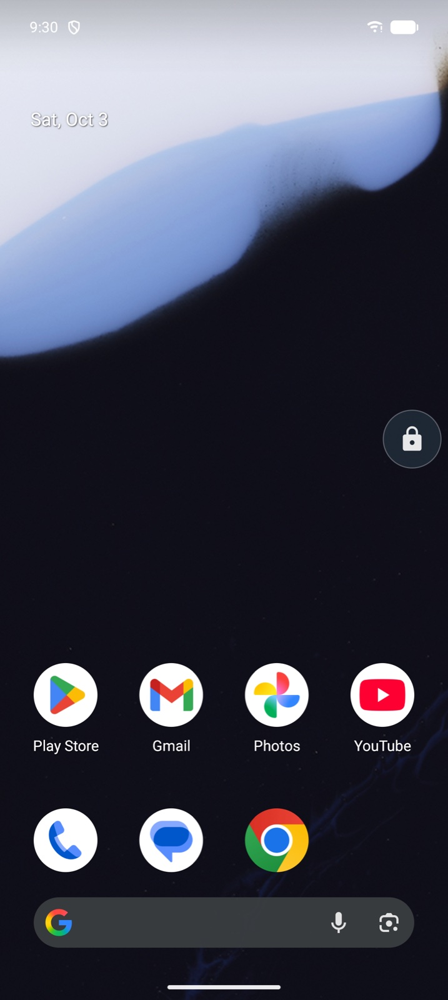
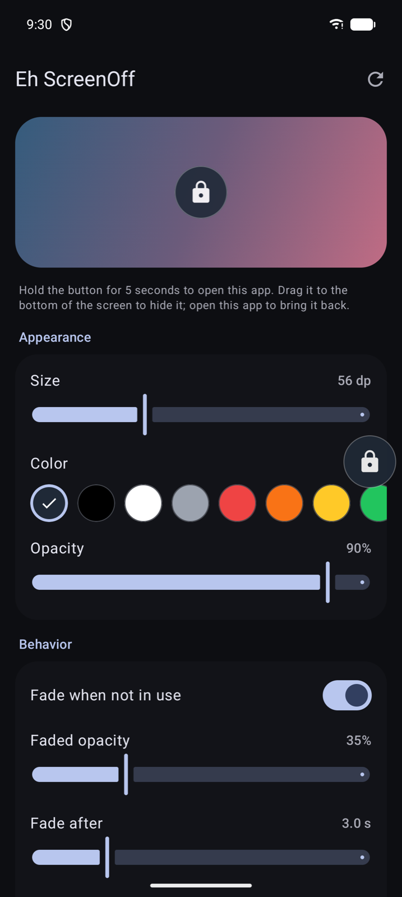
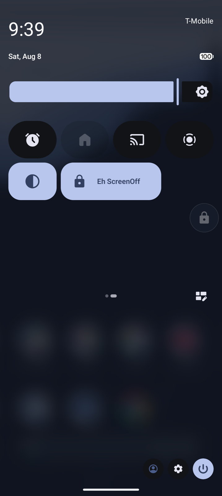
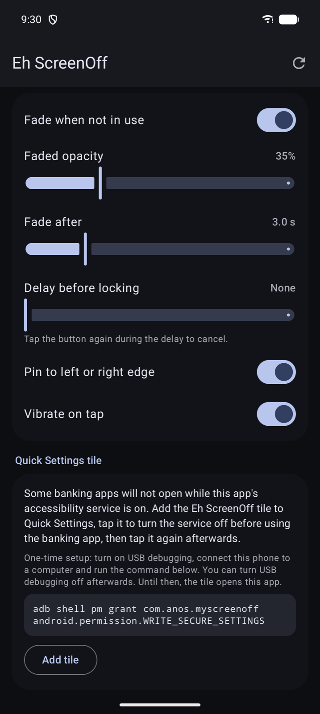

# Eh ScreenOff

A floating button that locks your Android phone's screen with one tap, so you don't have to reach for the power button. Unlike most "screen off" apps, it keeps fingerprint and face unlock working after the screen locks.

<p align="center">
  
  
  
</p>

## Features

- **One-tap lock.** Tap the floating button to turn the screen off and lock the phone. Fingerprint and face unlock keep working.
- **Lock delay.** Optionally wait up to 3 seconds before locking. Tap again during the delay to cancel.
- **Draggable.** Move the button anywhere, and optionally pin it to the left or right edge. It stays in place across rotations.
- **Hide and bring back.** Drag the button onto the ✕ at the bottom of the screen to hide it. Open the app to bring it back.
- **Hold to open the app.** Hold the button for 5 seconds to open the settings screen. Letting go earlier does nothing, so an aborted hold never locks the phone.
- **Customizable look.** Size (36–96 dp), 12 colors, opacity, and fading when not in use.
- **Out of the way.** The button hides itself while the screen is off or the lock screen is up.
- **Quick Settings tile.** Turn the service off and on from Quick Settings, e.g. for banking apps (see below).

## Requirements

- Android 12 (API 31) or newer.

## Install

Build the APK (see [Building](#building)) and install it on your phone.

1. Open the app and tap **Open Accessibility settings**.
2. Choose **Eh ScreenOff** and turn it on.
3. If the switch is greyed out (Android 13+ blocks this for apps installed outside an app store), open the app's **App info**, tap the **⋮** menu, choose **Allow restricted settings**, and try again.

The floating button appears as soon as the service is on.

## Banking apps and the Quick Settings tile

Many banking apps refuse to run while an accessibility service from an app installed outside an app store is turned on, and ask you to turn it off or uninstall the app. Eh ScreenOff can't change that check, but it makes switching the service off and on a single tap.

<p align="center">
  
</p>

1. **Grant the permission once.** Android only lets apps switch accessibility services with `WRITE_SECURE_SETTINGS`, and only adb can grant it. Turn on USB debugging, connect the phone to a computer and run:

   ```bash
   adb shell pm grant com.anos.myscreenoff android.permission.WRITE_SECURE_SETTINGS
   ```

   The permission survives reboots and app updates, and is only removed when the app is uninstalled. You can turn USB debugging off afterwards.

2. **Add the tile.** In the app, tap **Add tile** (Android 13+), or add the **Eh ScreenOff** tile yourself from the Quick Settings editor.

3. **Use it.** Tap the tile to turn the service off before opening your banking app, and tap it again afterwards. The tile is lit while the service is on.

Without the permission, tapping the tile opens the app instead. With the permission, the setup card's button turns the service on directly, without going through Accessibility settings.

## How it works

Android offers apps two ways to lock the screen:

| | Device admin `lockNow()` | Accessibility `GLOBAL_ACTION_LOCK_SCREEN` |
|---|---|---|
| Next unlock | PIN, pattern or password required | Fingerprint and face unlock work |
| Floating button | Needs the "display over other apps" permission | Drawn as an accessibility overlay |

Eh ScreenOff uses an accessibility service, so locking behaves exactly like pressing the power button.

### Privacy

- The service subscribes to **no accessibility events** and **cannot read window content** (`canRetrieveWindowContent="false"`). It only draws the button and performs the lock action.
- The app has **no internet permission**. Settings are stored on the device with DataStore.
- The only permission it declares is `WRITE_SECURE_SETTINGS`, which is used only by the Quick Settings tile to switch its own service.

## Building

Requires JDK 17+ and the Android SDK (compile SDK 36).

```bash
./gradlew assembleRelease
```

The APK is written to `app/build/outputs/apk/release/app-release.apk`.

Release signing reads `keystore/keystore.properties`. The keystore in this repository is a **development key**, committed for convenience because the app is not published. Do not use it to sign anything you distribute; create your own key and point `keystore.properties` at it. Without `keystore.properties`, `assembleRelease` still works but produces an unsigned APK.

Run the unit tests with:

```bash
./gradlew testDebugUnitTest
```

## Project structure

```
app/src/main/java/com/anos/myscreenoff/
├── MainActivity.kt                 Hosts the settings screen
├── data/                           Button settings and their DataStore repository
├── service/
│   ├── ScreenOffService.kt         Accessibility service: shows the button, locks the screen
│   ├── FloatingButton.kt           The draggable overlay button and its dismiss target
│   ├── ButtonGeometry.kt           Position math for the button
│   ├── ServiceToggleTile.kt        Quick Settings tile that switches the service
│   └── EnabledServices.kt          Edits Android's list of enabled accessibility services
└── ui/                             Compose settings screen and theme
```
